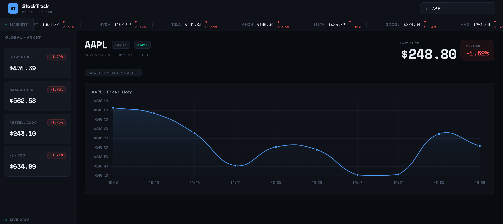

# 📈 StockTrack — Real-Time Market Dashboard

A high-performance stock tracking web app engineered to bypass API rate limits using a custom dual-key background caching architecture.

[](https://stockpricetrackerapp.netlify.app/)


---

## 🚀 Overview

StockTrack is a full-stack web application for tracking real-time stock prices, monitoring market indices, and visualizing historical trends.

**The Engineering Challenge:** Free-tier financial APIs impose aggressive rate limits (e.g., 8 requests/minute), making real-time dashboards nearly impossible to scale.

**The Solution:** A custom **Split-Fetch Dual-Key Architecture** powered by a Python background scheduler. By continuously syncing a global RAM cache and an SQLite database behind the scenes, the frontend achieves zero-latency load times — without consuming a single API credit per user request.

---

## 🔥 Key Features

- ⚡ **Zero-Latency Dashboard** — Core market data is served instantly from an in-memory Python cache, reducing load times to milliseconds.
- 🔑 **Dual-Key Split-Fetching** — Batch requests are split across multiple Twelve Data API keys simultaneously to legally bypass per-minute rate limits.
- 🔍 **Smart Fallback Search** — Custom ticker search checks the RAM cache first; only falls back to a live API call if the symbol isn't cached.
- 📊 **Historical Charting** — Chart.js visualizations powered by an hourly background worker that logs 5-minute interval data to SQLite.
- 🛢 **99% API Call Reduction** — Centralizing data fetching on the server means infinite frontend traffic with zero risk of exceeding daily API quotas.

---

## 💻 Tech Stack

**Frontend**

- React.js
- Chart.js / react-chartjs-2
- Tailwind CSS / Custom CSS Variables
- Axios
- Hosted on **Netlify**

**Backend**

- Python / Flask
- APScheduler (Background Task Management)
- SQLAlchemy & SQLite (Persistent Historical Database)
- Twelve Data API (Financial Data Provider)
- Hosted on **Render**

---

## 🧠 Architecture

```
┌─────────────────────────────────────────────────┐
│                  Python Backend                 │
│                                                 │
│  APScheduler (every 15 min)                     │
│    └─► Split-fetch across API Key 1 + Key 2     │
│         └─► Write prices to RAM cache           │
│                                                 │
│  APScheduler (every 60 min)                     │
│    └─► Write 5-min interval data to SQLite      │
│                                                 │
│  Flask /api/market/batch                        │
│    └─► Return RAM cache instantly (0 latency)   │
└─────────────────────────────────────────────────┘
          ▲                        ▲
          │ Single API call        │ Historical data
          │                        │
┌─────────────────────────────────────────────────┐
│                  React Frontend                 │
│    Dashboard loads from cache — API limits      │
│    are completely invisible to the user         │
└─────────────────────────────────────────────────┘
```

**The Writer:** Every 15 minutes, APScheduler fetches live prices for 14 core indices/stocks using the dual-key split strategy and writes them to a global RAM dictionary. Every 60 minutes, it writes historical data to SQLite.

**The Reader:** When a user opens the app, the React frontend makes a single call to `/api/market/batch`. Flask returns the in-memory dictionary instantly — Twelve Data's rate limits are never touched.

---

## 🛠️ Local Setup

You'll need two free API keys from [Twelve Data](https://twelvedata.com/).

### 1. Backend

```bash
# Clone the repo
git clone https://github.com/yourusername/stocktrack.git
cd stocktrack/backend

# Install Python dependencies
pip install -r requirements.txt

# Create and populate the .env file
touch .env
```

Add your keys to `.env`:

```
TWELVE_DATA_API_KEY_1=your_first_api_key_here
TWELVE_DATA_API_KEY_2=your_second_api_key_here
```

Start the Flask server:

```bash
python app.py
```

### 2. Frontend

```bash
# In a new terminal
cd ../frontend

# Install dependencies
npm install

# Ensure api.js points to http://127.0.0.1:5000 for local dev

# Start the dev server
npm start
```

---

## 📄 License

This project is open source. Feel free to fork, extend, and build on it.
